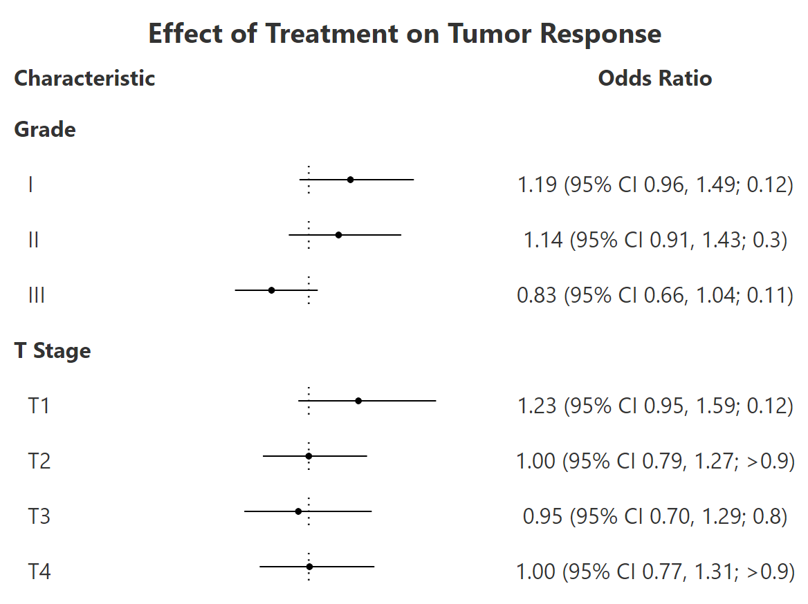

<!-- README.md is generated from README.Rmd. Please edit that file -->

```{r, include = FALSE}
knitr::opts_chunk$set(
  collapse = TRUE,
  comment = "#>",
  fig.path = "man/figures/README-",
  out.width = "100%"
)
```

# gtforester

<!-- badges: start -->
[](https://app.codecov.io/gh/ddsjoberg/gtforester?branch=main)
[](https://github.com/ddsjoberg/gtforester/actions/workflows/R-CMD-check.yaml)
<!-- badges: end -->

**Very** experimental and early stage package for creating forest plots from gtsummary tables.
The result is a gt table that includes the plot.

## Installation

You can install the development version of gtforester from [GitHub](https://github.com/) with:

``` r
# install.packages("devtools")
devtools::install_github("ddsjoberg/gtforester")
```

## Example

```{r example}
library(gtforester)

tbl <- 
  trial %>%
  select(age, marker, grade, response) %>%
  tbl_uvregression(
    y = response, 
    method = glm, 
    method.args = list(family = binomial),
    exponentiate = TRUE,
    hide_n = TRUE
  ) %>%
  modify_column_merge(
    pattern = "{estimate} (95% CI {ci}; {p.value})",
    rows = !is.na(estimate)
  ) %>%
  modify_header(estimate = "**Odds Ratio**") %>%
  bold_labels() %>%
  add_forest()
```

```{r example-add_forest, include = FALSE}
gt::gtsave(tbl, file = "man/figures/README-add_forest.png")
```

```{r out.width = "76%", echo = FALSE}
knitr::include_graphics("man/figures/README-add_forest.png")
```

```{r}
tbl <-
  trial %>%
  tbl_subgroups(
    subgroups = c("grade", "stage"),
    ~ glm(response ~ trt, data = .x) %>%
      gtsummary::tbl_regression(
        show_single_row = trt,
        exponentiate = TRUE)
  ) %>%
  gtsummary::modify_column_merge(
    pattern = "{estimate} (95% CI {ci}; {p.value})",
    rows = !is.na(estimate)
  ) %>%
  gtsummary::modify_header(estimate = "**Odds Ratio**") %>%
  gtsummary::bold_labels() %>%
  add_forest() %>%
  gt::tab_header(gt::md("**Effect of Treatment on Tumor Response**"))
```

```{r example-tbl_subgroups, include = FALSE}
gt::gtsave(tbl, file = "man/figures/README-tbl_subgroups.png")
```

```{r out.width = "76%", echo = FALSE}

```
