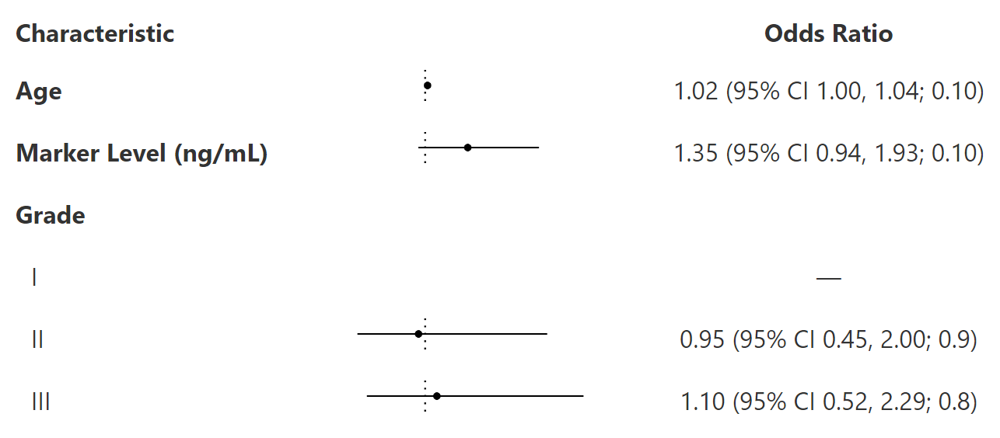

<!-- README.md is generated from README.Rmd. Please edit that file -->

# gtforester

<!-- badges: start -->

[](https://app.codecov.io/gh/ddsjoberg/gtforester?branch=main)
[](https://github.com/ddsjoberg/gtforester/actions/workflows/R-CMD-check.yaml)
<!-- badges: end -->

**Very** experimental and early stage package for creating forest plots
from gtsummary tables. The result is a gt table that includes the plot.

## Installation

You can install the development version of gtforester from
[GitHub](https://github.com/) with:

``` r
# install.packages("devtools")
devtools::install_github("ddsjoberg/gtforester")
```

## Example

``` r
library(gtforester)
#> Loading required package: gtsummary

tbl <- 
  trial %>%
  select(age, marker, grade, response) %>%
  tbl_uvregression(
    y = response, 
    method = glm, 
    method.args = list(family = binomial),
    exponentiate = TRUE,
    hide_n = TRUE
  ) %>%
  modify_column_merge(
    pattern = "{estimate} (95% CI {ci}; {p.value})",
    rows = !is.na(estimate)
  ) %>%
  modify_header(estimate = "**Odds Ratio**") %>%
  bold_labels() %>%
  add_forest()
```


